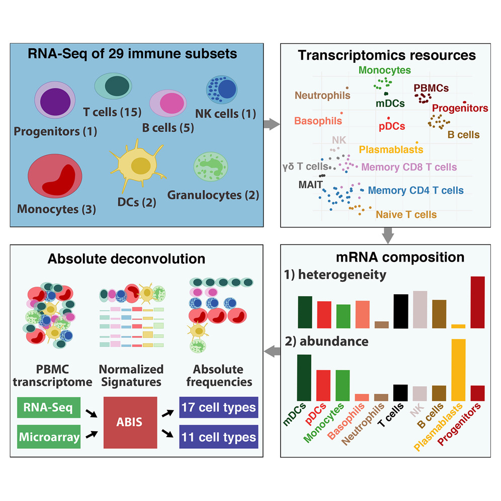

# immune_population.pro

Download and prepare immune population data for analyses :policeman:

## RNA-Seq Signatures Normalized by mRNA Abundance Allow Absolute Deconvolution of Human Immune Cell Types

### Characterized 29 human PBMC cell types (long and short names).

![]

---

## Howdy :wave: :cowboy_hat_face:

To report a bug, request a feature, or leave a comment, just [submit an issue](https://github.com/KwatMDPhD/get_immune_population.pro/issues/new/choose).

---

_**Lean Project** powered by https://github.com/KwatMDPhD/LeanProject.jl_
